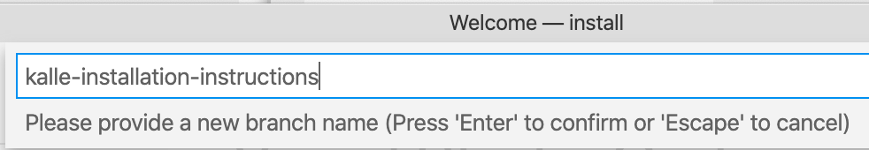
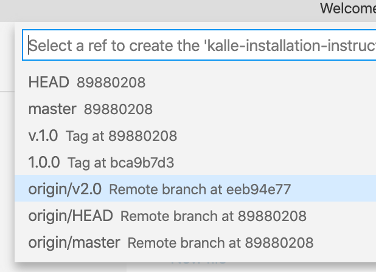
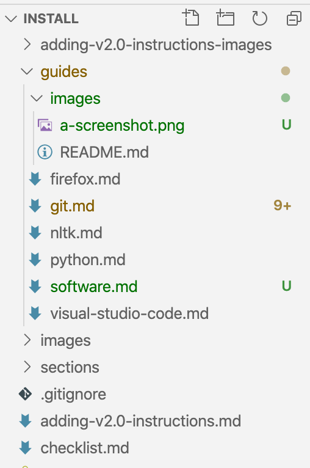
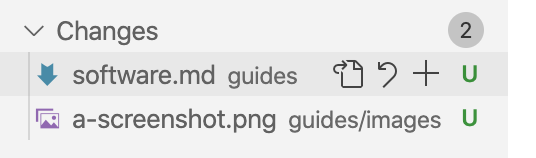
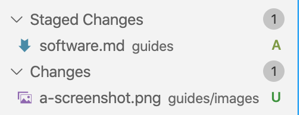
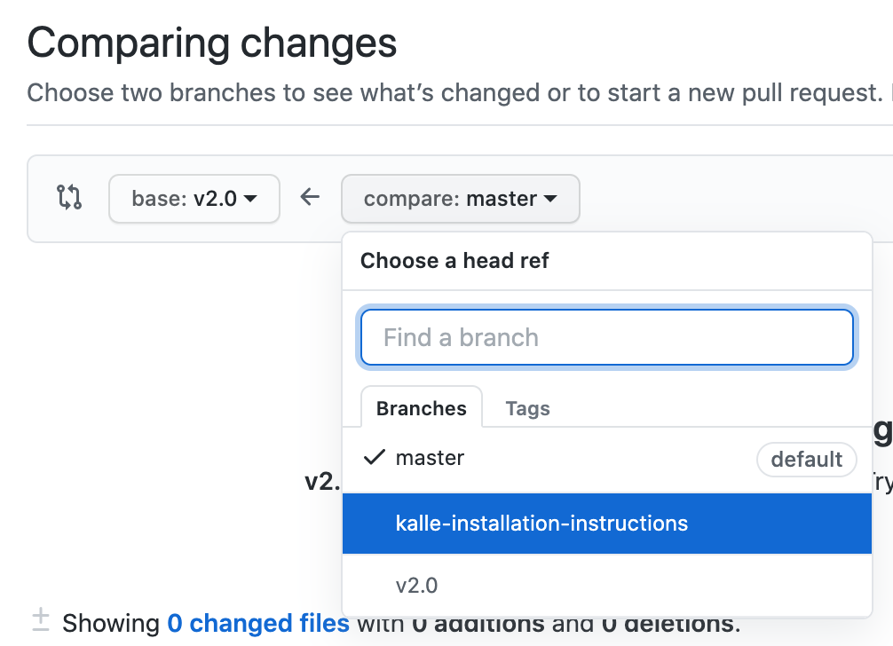
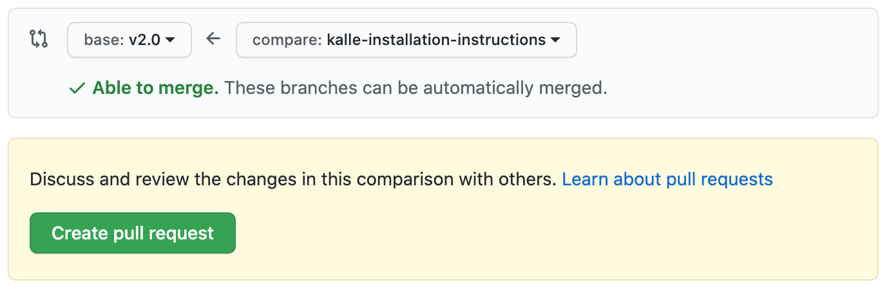
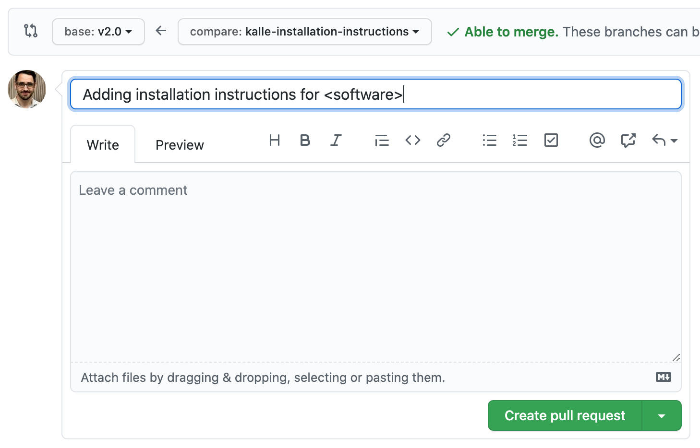

# How to add installation instructions to this repository

In this tutorial, we will use VS Code but if you prefer, you can use any other editor or even command line tools.

## 1. Clone the repository.

1. Bring up the Command Palette (<kbd>command</kbd> + <kbd>shift</kbd> + <kbd>P</kbd>).
   
2. Type `git clone`.
   
3. When asked to provide repository URL, paste `https://github.com/DHRI-Curriculum/install/` into the box.
   
4. VS Code will ask you where to save your local clone of the repository. Choose wherever you would like to have it.
   
5. When asked "Would you like to open the cloned repository?", press "Open in New Window" (to ensure no conflict with any other windows you may have open).

## 2. Create your own branch.
   
1. Click the branch name that you are currently on (likely "master") in the lower-left corner  
   

2. Select "Create new branch from..."  
   
   
3. Provide a branch name for your new branch (something like `<your-username>-installation-instructions`) followed by <kbd>enter</kbd>  
   
   
4. When asked to "Select a ref to create" your branch, select `origin/v2.0`  
   
   
5. You should now be on your own branch of this repository. You can verify that you're on the correct branch by checking your lower-left corner that should have your branch name instead of the formerly active branch.  
   

## 3. Add the installation instructions you have been assigned.

1. Each instruction should be in a separate `<software>.md` file, which should already be created inside the [`guides`](https://github.com/DHRI-Curriculum/install/tree/v2.0/guides) directory. Keep the filename as it is.
   
2. Under the `## What it is` header, add a description of the software that this guide will install. Be specific as we consider following installation instructions to be part of the foundational skills that learners will acquire in the DHRI.
   
3. Under the `## Why we use it` header, add a description that follows the format below:

   > For the Digital Humanities Research Institute, we use \<insert software here> because \<insert reason why we use this software. If it is used instead of another one, explain why we have chosen this software.>
   
4. Under the two headings `## Installation instructions: macOS Catalina` and `## Installation instructions: Microsoft Windows 10` respectively, add installation instructions:

   - Each step should be added as a level 3 header (`###`) following this convention: `### Step 1: <Insert Step 1 Header>`
   - Each instruction step should follow this convention: A step should contain no more than one or two clicks/dragging files, or entering information into text boxes, unless there is, for example, a form where you may need to input multiple points of information in the same place.
   - Include a screenshot for each step - see below for example of how to insert it. If there are more complicated things to do, consider making a GIF. Make sure screenshots are up to date and added inside the [`guides/images`](https://github.com/DHRI-Curriculum/install/tree/v2.0/guides/images) directory.
   
(Each of the files with the installation instructions should already have a model of what the finished markdown should look like. If you have any questions, don't hesitate to reach out to [@kallewesterling](https://github.com/kallewesterling) to ask for further instructions.)
   
---

Once you are done with _all of the instructions you would like to add and have added all your screenshots_, your VS Code should look something like this:

---

## 4. Commit your changes and synchronize with GitHub.

1. Press the version control button in your menubar on the left (alternatively, you can choose `SCM` from the `View` menu).  
   

2. Hover over the instruction file you have added and all the screenshot files and press the `+` button to add the files to your commits. Once you press the `+` button, the file should move from the `Changes` section to the `Staged Changes` section. Once all your files are in the `Staged Changes` section, you are ready to move on.  
     
   
      
3. In the `Message` box, type an instructive message, something along the lines of `Adding installation instructions` and then press the checkmark above the message box (<kbd>✓</kbd>). Alternatively, you can press <kbd>command</kbd> + <kbd>enter</kbd>.
   
4. Next, you want to synchronize your commit(s) with GitHub, by pressing the icon next to your branch name. If it's your first time, it will be a little cloud with an arrow into it. Otherwise, it will be two arrows forming a circle:   
     
   
   
## 5. Add a pull request to the `v2.0` branch

1. Navigate to GitHub's [Compare changes](https://github.com/DHRI-Curriculum/install/compare/v2.0...master) page.
   
2. Ensure that the `base` branch (the one you want to merge your changes _into_) is selected as `v2.0`:   
   

3. On the `compare` side, you want to choose your own branch in the popup menu:   
   

4. You should see a large, green button that says "Create pull request" and a green checkmark that says that you're able to merge:   
   
      
5. Press the "Create pull request" button, and fill out the form that pops up with some important information. Then press the green "Create pull request" button at the bottom of the form.  
     

You're done. Once someone gets around to it, your changes will be merged into the repository.
