# Git (and Git Bash)

## Instructions (**Remove this section once you are done with your file**)

(Copy over installation instructions from here: https://github.com/DHRI-Curriculum/install/blob/v2.0/sections/git.md into this file: https://github.com/DHRI-Curriculum/install/edit/v2.0/guides/git.md)

Follow this format:

## What it is

Git is a version control software used to manage and track changes made to files and project folders over time. We will be installing it on our local machine and live on the hard drive on your laptop. 

Note that Git is a separate software than GitHub. Alternatively, GitHub is a web-based software that lives on the Internet. 

These instructions are for Git, not GitHub.

## Why we use it

For the Digital Humanities Research Institute, we use Git because it.. 

- open source
- version control..
- supports collaboration across time and space.. 
- we use it for the curriculum.. 

---

## Installation instructions: macOS Catalina

### Step 1: Open a terminal

The terminal, also known as command line, is a text interface to your computer and it differs what how we usually interact with our computers. Usually, we use softwares that come with a graphical user interface - GUI, pronounced *gooey* - and we point and click on buttons and drag and drop things. With Git, we type text into the terminal. The text you type in will be a mix of standard commands, file names, and other text.

To open the terminal, open spotlight search (default way to do this is by hitting command and the space bar) and type in “terminal”. Select the application called terminal and press the return key. This should open up an app with a black background. When you see your username followed by a dollar sign, you’re ready to start using command line.

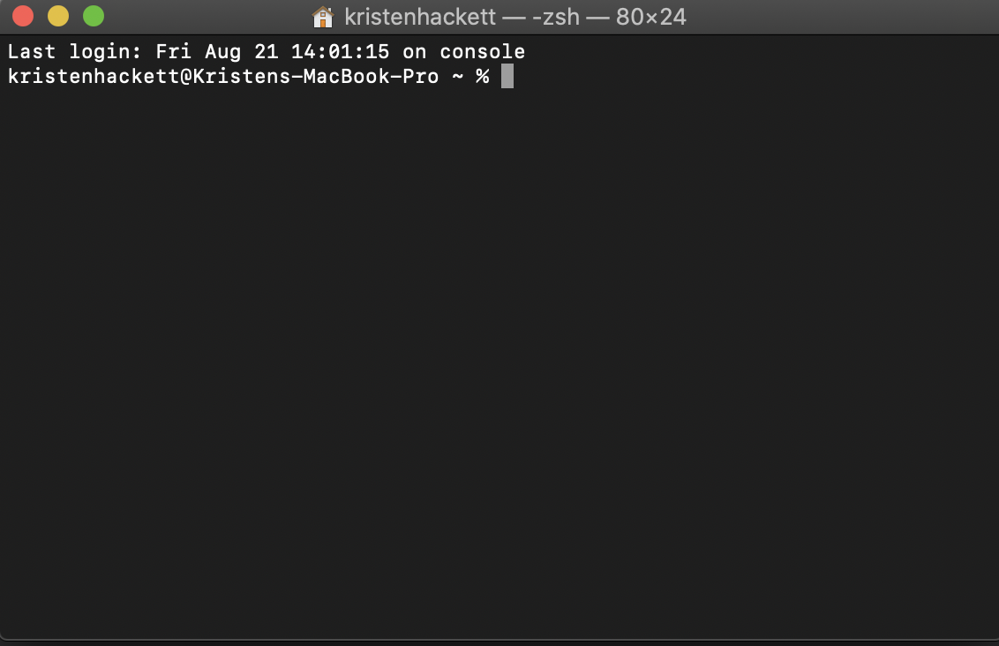

### Step 1: Type the following command into the terminal

```bash
xcode-select --install
```

This standard command installs the Command Line Tool Package. This give Mac users many commonly used tools, utilities, and compilers, including make, GCC, clang, perl, svn, size, strip, strings, libtool, cpp, what--and Git.

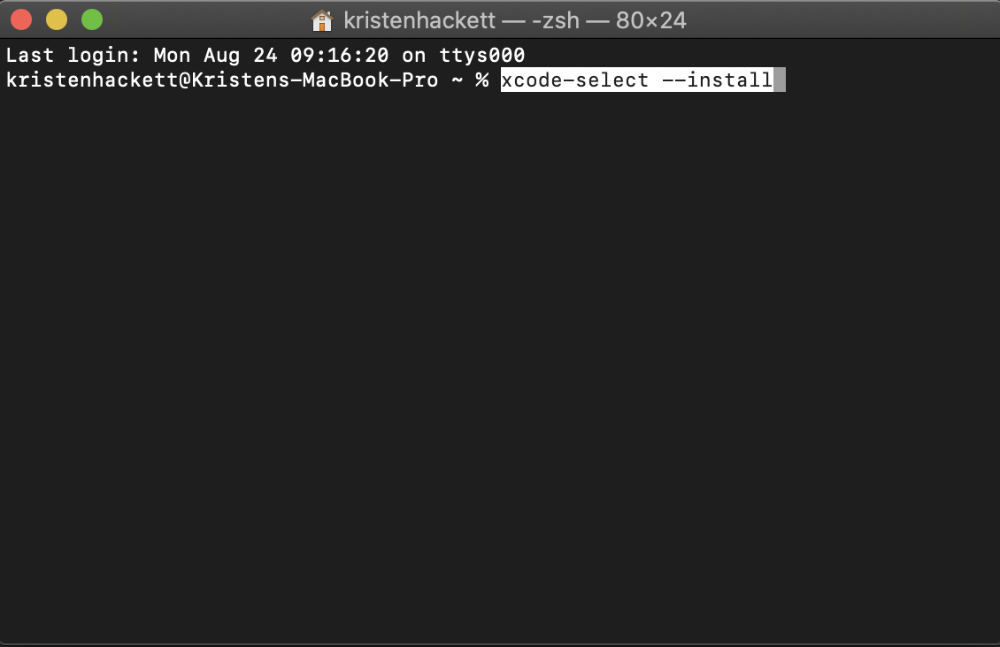

### Step 2: Test the Install

Before proceeding, let's make sure Git has been installed successfully. 

- Open your terminal. 

[shows terminal on mac osx](osx_terminal.md) 

- Type the following into the terminal:
```bash
 git
 ```

The terminal should print something like (note that this is truncated):

```bash
usage: git [--version] [--help] [-C <path>] [-c name=value]
           [--exec-path[=<path>]] [--html-path] [--man-path] [--info-path]
           [-p | --paginate | --no-pager] [--no-replace-objects] [--bare]
           [--git-dir=<path>] [--work-tree=<path>] [--namespace=<name>]
           <command> [<args>]


```

## Updating an earlier development version of Git (that is already installed) 

### Step 1: Check which development version of Git is currently installed on the computer.  

Open your terminal and type the following into the terminal:
```bash 
git --version
 ```

Check for the most recent development version of Git on their website [here](https://git-scm.com/downloads).

### Step 2: Update your version - if needed.

To update a computer that already has an earlier development version: 

Open [the Git website downloads page](https://git-scm.com/downloads) in a browser and follow the posted download instructions according to the computer type: Mac, Linux/Unix, or Windows.  

### Step 3: Recheck which development version by repeating step 1.

Then, check that the new development version of Git is now installed:

Close, and re-open your terminal and type the following into the terminal:
```bash 
git --version
 ```

---

## Installation instructions: Microsoft Windows 10

### Step 1: Download Git for Windows

Go to this website: https://git-scm.com/download/win

From the option, select "Click here to download manually" and save the file. 

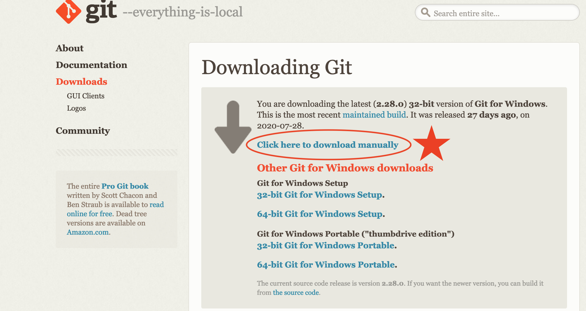

### Step 2: *Click* on the git installer:

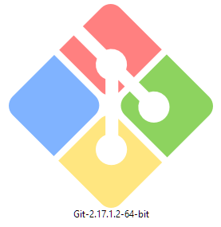

### Step 3: Accept the license and *click* `Next`:

 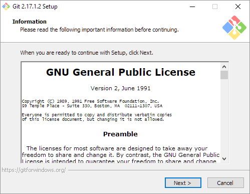

### Step 4: Select the installation folder:

The default folder should be fine. *Click* `Next`.

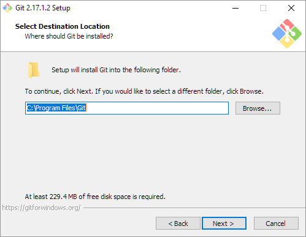

### Step 5: Select the components to be installed: 

Again, the default is fine here.


- Windows Only: select start menu folder (default is fine):


### Step 6: Choose the default editor used by Git. 

Select `Visual Studio Code` as the default editor. (Note that you must [install `Visual Studio Code`](vscode.md) first before you can move forward past this step of the Git install.) 

*Click* `Next` when you're ready.

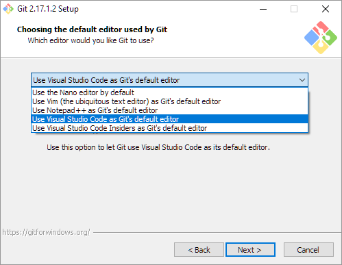

### Step 7: Choose the "Use Git from the Windows Command Prompt" radio button.

*Click* `Next` when you're ready.

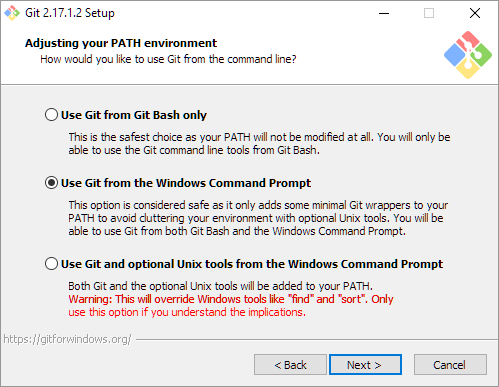 

### Step 8: Choose the HTTPS transport backend (the default is fine).

*Click* `Next` when you're ready.


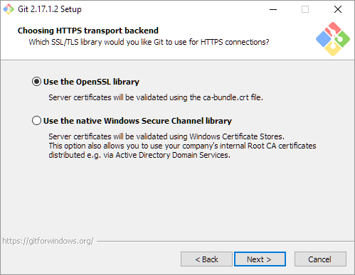

### Step 9: Configure the line ending conversions.

Again, the default is fine. *Click* `Next` when you're ready.

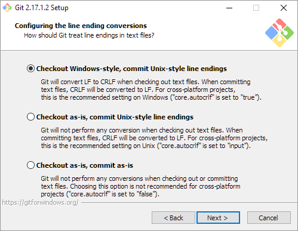

### Step 10: Configure the terminal emulator.

On the 'configuring the terminal emulator to use with Git Bash' window, choose the "Use Windows default console window" option.

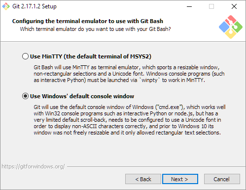
Note: Do not choose "Use MinTTY (the default terminal of MSYS2)" as that MinTTY wil break Python. 

### Step 11: Configure the extra options. 

Again, the defaults are fine. *Click* `Next` when you are ready.


### Step 12: Git should now be installing.
 
 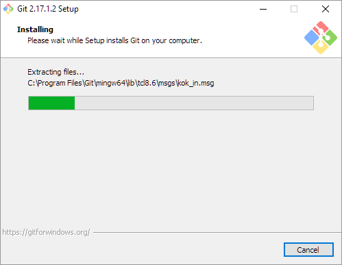

### Step 13: Finish the installation.

*Click* through the rest of the install, leaving the defaults, and then *click* `Finish` on the last window.

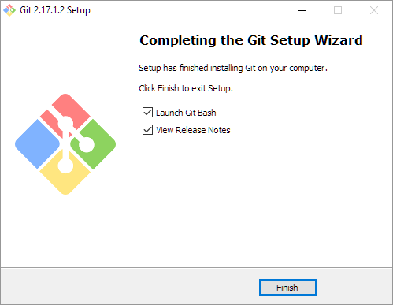

### Step 14: Test the install.

Before proceeding, let's make sure Git has been installed successfully. 

- Open Your terminal 


- Type the following into the terminal:
```bash
 git
 ```

The terminal should print something like (note that this is truncated):

```bash
usage: git [--version] [--help] [-C <path>] [-c name=value]
           [--exec-path[=<path>]] [--html-path] [--man-path] [--info-path]
           [-p | --paginate | --no-pager] [--no-replace-objects] [--bare]
           [--git-dir=<path>] [--work-tree=<path>] [--namespace=<name>]
           <command> [<args>]


```

## Updating an earlier development version of Git (that is already installed) 

### Step 1: Check which development version of Git is currently installed on the computer.  

Open your terminal and type the following into the terminal:
```bash 
git --version
 ```

Check for the most recent development version of Git on their website [here](https://git-scm.com/downloads).

### Step 2: Update your version - if needed.

To update a computer that already has an earlier development version: 

Open [the Git website downloads page](https://git-scm.com/downloads) in a browser and follow the posted download instructions according to the computer type: Mac, Linux/Unix, or Windows.  

### Step 3: Recheck which development version by repeating step 1.

Then, check that the new development version of Git is now installed:

Close, and re-open your terminal and type the following into the terminal:
```bash 
git --version
 ```