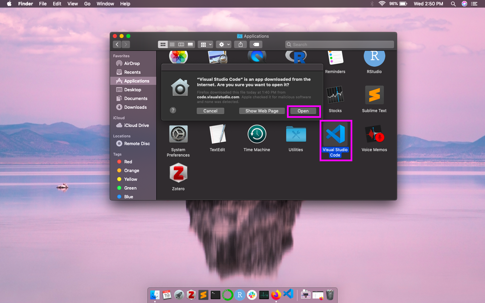
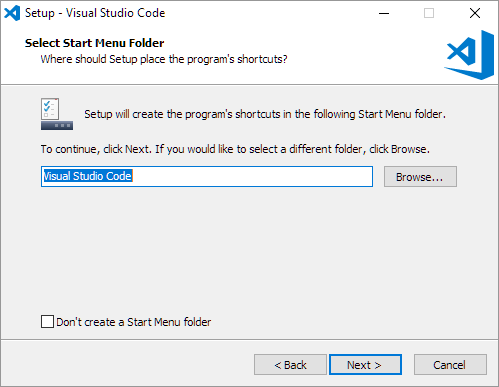
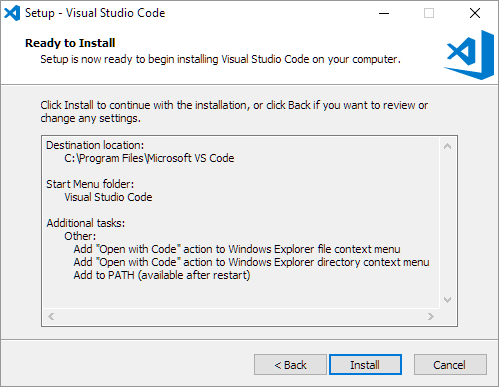

# Microsoft Visual Studio Code

## Instructions (**Remove this section once you are done with your file**)

(Copy over installation instructions from here: https://github.com/DHRI-Curriculum/install/blob/v2.0/sections/vscode.md into this file: https://github.com/DHRI-Curriculum/install/edit/v2.0/guides/visual-studio-code.md)

Follow this format:

## What it is

Visual Studio Code is a text editor that allows us to write code in a variety of computational languages such as python, HTML, javascript, among others.

## Why we use it

For the Digital Humanities Research Institute, we use Visual Studio Code because it supports [syntax highlighting](https://en.wikipedia.org/wiki/Syntax_highlighting), it is free and built on open source, and it is consistent across Mac, Windows, and Linux systems.

---

## Installation instructions: macOS Catalina

### Step 1: <Insert Step 1 Header>

Visit the [Visual Studio Code website](https://code.visualstudio.com/) on your internet browser, such as Firefox or Safari, and click `Download for Mac`. Then click `Save File` in the dialogue box that asks if you would like to save the file

### Step 2: <Insert Step 2 Header>

After the download has completed, double click on the file called `VSCode-darwin-stable.zip` in your Downloads folder. 

### Step 3: <Insert Step 3 Header>

Drag the Visual Studio Code application (it will have a blue logo next to it) from your Downloads folder to Applications folder.

### Step 4

Double click the Visual Studio Code application in your Applications folder. The first time you open Visual Studio Code, you should receive a dialogue box that asks you if you are sure you would like to open it. Here you should click `Open`. 

### Step 5

Navigate to the `View` option in the topmost menu and click `Command Palette`. This will make a text bar appear.

### Step 6

Type "shell" into the text bar that appears. Then choose `Shell Command: Install code command in PATH`. Click `OK` on the dialogue box that appears saying "Code will now prompt with 'osascript' for Administrator privileges to install the shell command." You may also be asked to provide the password to your computer at this stage.

### Step 7

Congratulations, Visual Studio Code is now installed in your computer!

---

## Installation instructions: Microsoft Windows 10

### Step 1: <Insert Step 1 Header>

Visit the [Visual Studio Code website](https://code.visualstudio.com/) on your internet browser, such as Firefox, Edge, or Internet Explorer, and click `Download for Windows`. Then click `Save File` in the dialogue box that asks if you would like to save the file

 

### Step 2: <Insert Step 2 Header>

Click on the Visual Studio Code installer in your downloads folder

### Step 3: <Insert Step 3 Header>

Click `Next` when the Visual Code setup window opens.

### Step 4

Accept the license agreement by selecting the first radio button. Then click `next`.

### Step 5 

Choose the folder on the computer that VSCode should be installed in (the default is usually fine). Then click `Next`.

### Step 6

Choose the folder in the start menu that VSCode should be installed in. Check the other boxes at your own discretion. Then click `Next`.

### Step 7

Please check the box that says `Add to PATH`. Then click `Next`.

### Step 8

You should see a window listing the configurations you chose in the previous steps. If they are incorrect, click `Back` and redo the previous steps. If they are correct, click `Install`.

### Step 9

Sit back and relax because the install will take a while. You should see a window with a progress bar similar to this.

### Step 10

Check the `Launch Visual Studio Code` checkbox and then click `Next`.

### Step 11

Congratulations Visual Studio Code is now installed! You should see something similar to this window when you launch Visual Studio Code.

