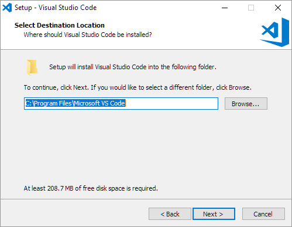
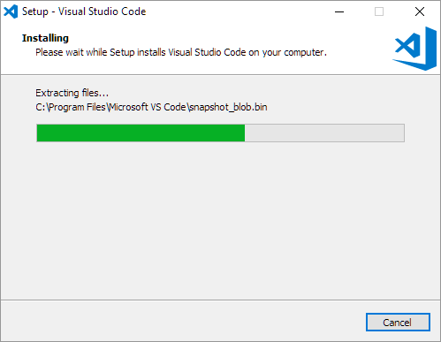

# Atom
A text editor is a simple notepad type application. For the DSRI, we will be using the [Atom](https://atom.io/) text editor, is free and open source, and is consistent across OSX, Windows, and Linux systems. [For Atom's full documentation go here](https://flight-manual.atom.io/getting-started/sections/why-atom/)

## Install
Download Atom at https://atom.io/ by clicking on:

### Once you have downloaded Atom follow the instructions below based on your OS

* [Windows instructions](#windows)
* [OS/X instructions](#osx)

### Windows

* we are working on it! [see Atom's documentation here](https://flight-manual.atom.io/getting-started/sections/installing-atom/#platform-windows)
<!--
1. *Click* on the VScode installer in your downloads folder:

2. When you see this window, *click* `Next`:

 
 
 3. Accept the license agreement by *selecting* the first radio button. Then *click* `next`  
 
 
 
 4. Choose the folder on the computer that VSCode should be installed in (the default is usually fine). Then *click* `Next`:
 
 
 
 4b. Windows only: Choose the folder in the start menu that VSCode should be installed in. Then *click* `Next`:
 
 
 
 4c. Windows only: Please *check* the box that says `Add to PATH`, which is the fifth (last) box. Check the other boxes at your own discretion. Then *click* `Next`:
 
 

5. You should see a window listing the configurations you chose in the previous steps. If they are incorrect, *click* `Back` and redo the previous steps. If they are correct, *click* `Install`:

 

6. Sit back and relax because the install will take a while. You should see a window with a progress bar similar to this:

 

7. *Check* the "Launch Visual Studio Code" checkbox and then *click* `Next`

8. [Test Install](#test-install)
-->

### OS/X

1. [Download Atom](#install)

2. *Save* atom-mac.zip file anywhere you want (it is easier to find if you save it to your desktop)

3. Once the download is complete, *double-clik* on it to open it

4. The Atom.app icon will appear next to the zip file

5. At this point you can leave the icon where it is or common practice is to move it to your applications folder
 
6. *Double-click* the icon to open Atom

7. There is a possibility that you will get a security pop-up that looks like this:

If you do, do the following:
   - Open *system preferences* and click on the security & privacy icon

   - At the bottom you will see an option to give permision to open Atom

## Test Install

Atom should now be installed. You should see something like this window when you open Atom:

 
