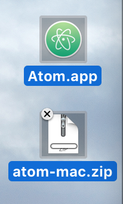
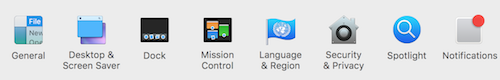

# Atom
A text editor is a simple notepad type application. For the DSRI, we will be using the [Atom](https://atom.io/) text editor, is free and open source, and is consistent across OSX, Windows, and Linux systems. [For Atom's full documentation go here](https://flight-manual.atom.io/getting-started/sections/why-atom/)

## Install
Download Atom at https://atom.io/ by clicking on:

### Once you have downloaded Atom follow the instructions below based on your OS

* [Windows instructions](#windows)
* [OS/X instructions](#osx)

### Windows

1. [Download Atom](#install)

2. *Save* AtomSetup.exe file anywhere you want (it is easier to find if you save it to your desktop)

3. Double click on AtomSetup.exe

4. You may see the following while Atom is being installed

5. Once Atom is installed, it will open automatically

6. You may see a message that looks like the one below, if you do, click no

Atom should now be installed. You should see something like this window when you open Atom:

### OS/X

1. [Download Atom](#install)

2. *Save* atom-mac.zip file anywhere you want (it is easier to find if you save it to your desktop)

3. Once the download is complete, *double-clik* on it to open it

4. The Atom.app icon will appear next to the zip file

5. At this point you can leave the icon where it is or common practice is to move it to your applications folder
 
6. *Double-click* the icon to open Atom

7. There is a possibility that you will get a security pop-up that looks like this:

If you do, do the following:
   - Open *system preferences* and click on the security & privacy icon

   - At the bottom you will see an option to give permision to open Atom

## Test Install

Atom should now be installed. You should see something like this window when you open Atom:

 
