 [Anaconda](https://www.anaconda.com/download/) is a distribution of Python. It provides a Python programming environment, the [Jupyter notebook environment](https://github.com/DHRI-Curriculum/install/blob/master/sections/jupyter.md), and the [conda](conda.md) package management system. 

# Choose the appropriate option and follow the instructions:

## I don't know if I have Anaconda installed on my computer
* Try to open the Anaconda Prompt (On Mac, press Cmd + Space and type `Anaconda`. On Windows, press the Windows key and type Anaconda). If no option comes up, you most likely don't have it installed.

## I do have Anaconda installed on my computer
* [Updating Anaconda to the newest version](#updating-anaconda)

## I don't have Anaconda installed on my computer
* [Installation Windows](#installation-windows)
* [Installation macOS](#installation-macos)

# Updating Anaconda (Mac or Windows)

If you have Anaconda installed, chances are that you need to update to the most recent version. So let's go ahead and do it.

First, let's check the most recent version of Anaconda available. Go to the [Anaconda Download Page](https://www.anaconda.com/download/). 

Under "Download Anaconda Distribution" you should be able to see the current version.

Now it is time to check what version you have installed in your computer. Open the Anaconda Prompt (On Mac, press Cmd + Space and type `Anaconda`. On Windows, press the Windows key and type Anaconda), type `conda --version` and press enter. If the output has the same version as the one on the website, you are good to go!

If you need to update your version, the easiest way is also on the Anaconda Prompt:

* Type `conda update -n root conda` and press Enter.
* Type Y for yes and press Enter when asked.
* Wait for the process to finish. It takes some time.

* When the process finishes, type `conda update --all` and press Enter
* Type Y for yes and press enter when asked.
* Wait for the process to finish. This should take even longer, so go grab a cup of coffee.
* After it is finished, type `conda --version` and press Enter. The output should be the same version as the one in the webpage.

# Installation Windows 

## Download Python 3.+: 

1. Download Anaconda at:  https://www.anaconda.com/download/ 
 
2. *Click* on the Python 3.+ button:

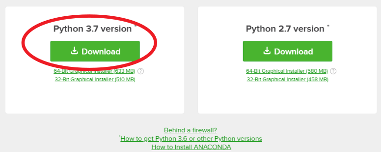

3. You can ignore this. Just close this screen and wait for your donwload to finish.


## Install

1. *Click* on the installer file you just downloaded:

2. You should see the initial install screen. *Click* `Next`:
 
 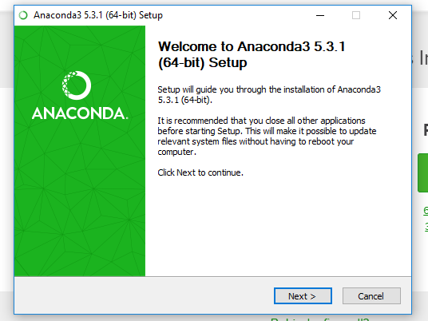

3. Accept the license by *clicking* `I Agree`:
 
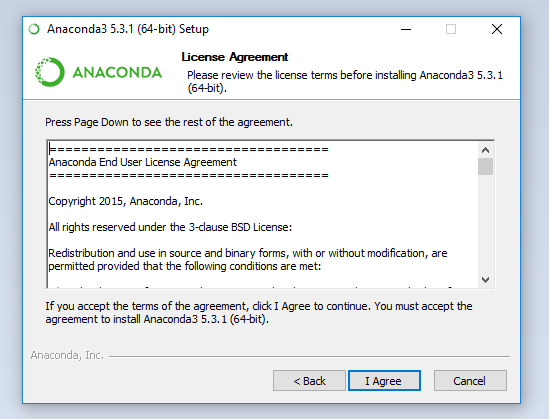

4. Install Anaconda only for yourself by choosing the just for me radio button. *Click* `Next`:

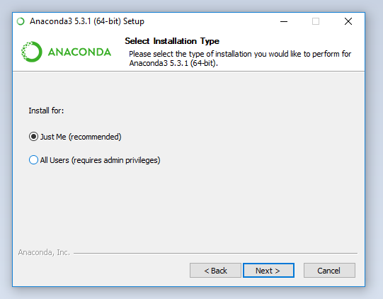

5. Choose the location to install anaconda (the default is fine). *Click* `Next`:

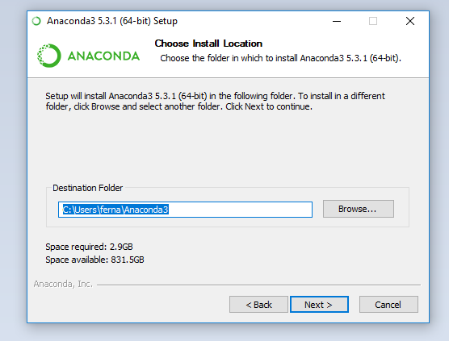

6. On the Advanced Installation Options page, select **both boxes**: "Add Anaconda to my PATH environment variable" and "Register Anaconda as my default Python". Then *click* `Next`: 


7. The installation may take a while, so go grab a snack or check your email: 

8. When finished, the window will list the location of the Anaconda installer. *Click* `Next`:

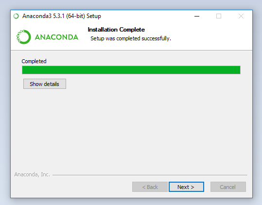

9. *Click* `Install Microsoft VSCode`. If it is already installed, *click* `Skip`:

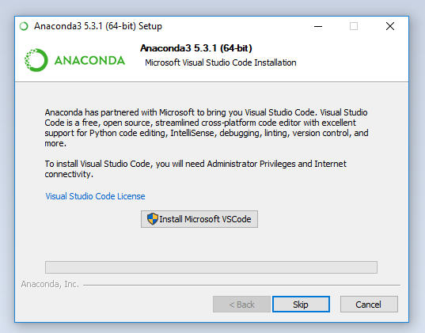

10. This is the final window. You can uncheck all the boxes and *Click* `Finish`:

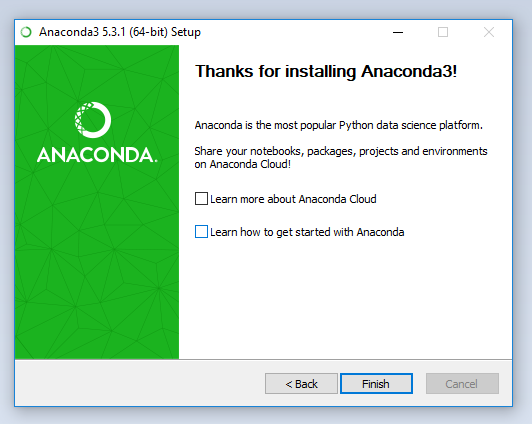

## Test

Open a [windows terminal](windows_terminal.md) and type `python`. The terminal should print something like:

    ```python
    Python 3.6.5 |Anaconda, Inc.| (default, Mar 29 2018, 13:32:41) [MSC v.1900 64 bit (AMD64)] on win32
    Type "help", "copyright", "credits" or "license" for more information.
    >>> 
    ```

Type `exit()` to leave python

## References ##

* [Anaconda Cheet Sheet](http://conda.pydata.org/docs/using/cheatsheet.html)

* [Jupyter Reference Sheet](https://damontallen.github.io/IPython-quick-ref-sheets/)

# Installation macOS

## Download Python 3.+: 

1. Download Anaconda at:  https://www.anaconda.com/download/ 
 
2. *Click* on the Python 3.+ button:


3. You can ignore this. Just close this screen.

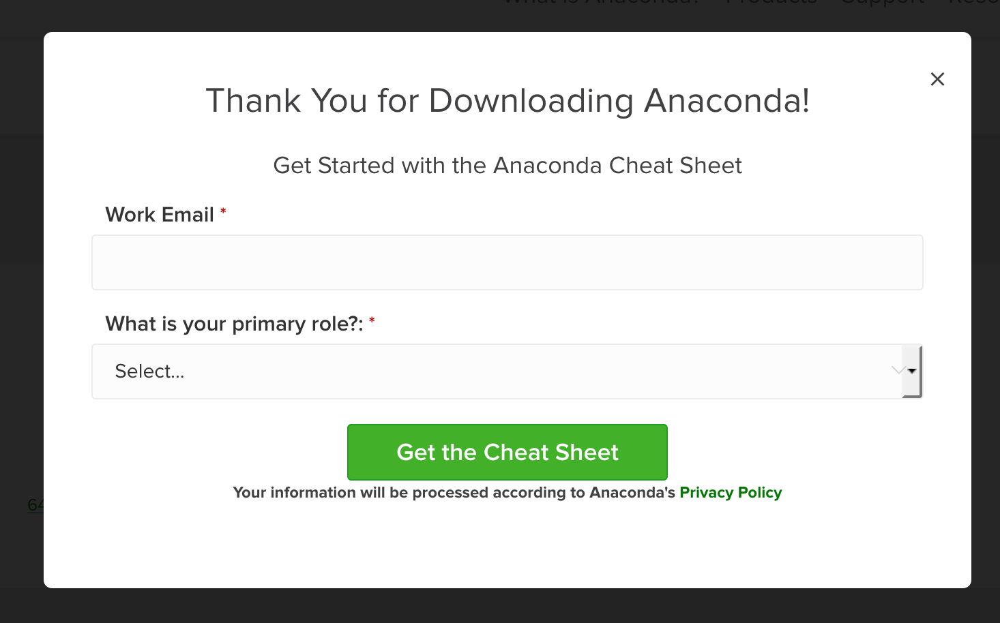

4. Either let your browser open with the Installer, or save it and open it yourself

## Install

1. In case it doesn't open automatically, *Click* on the installer file you just downloaded:

2. *Click* `Continue`:

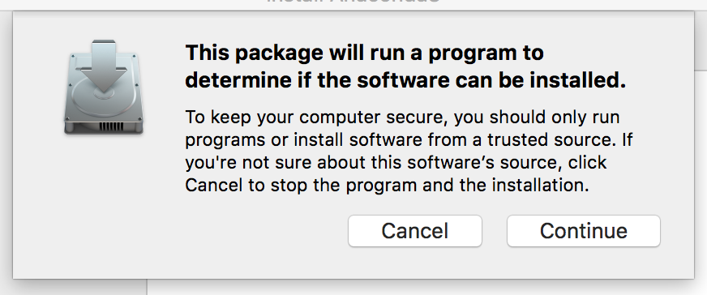

3. You should see the initial install screen. *Click* `Continue`:
 
 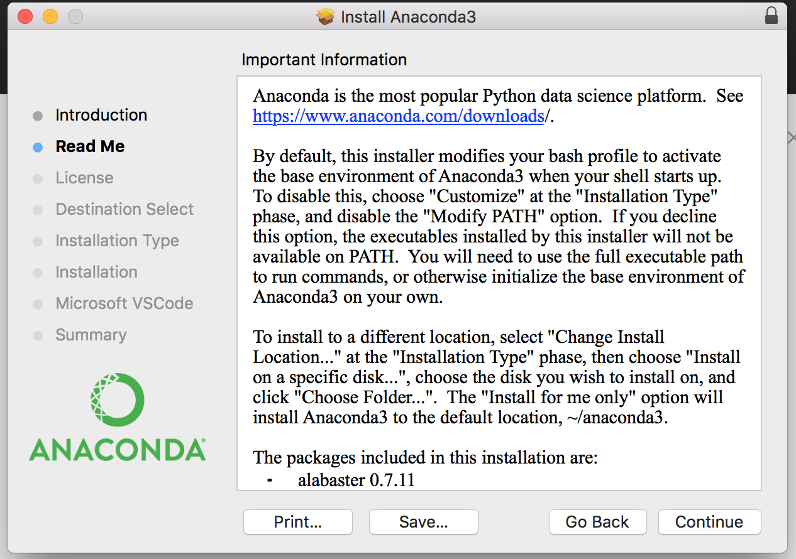

4. *Click* `Continue` again:

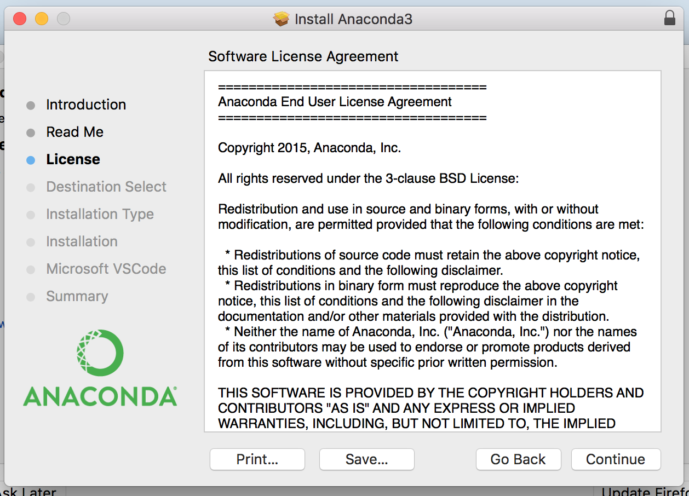

3. Accept the license by *clicking* `I Agree`:
 
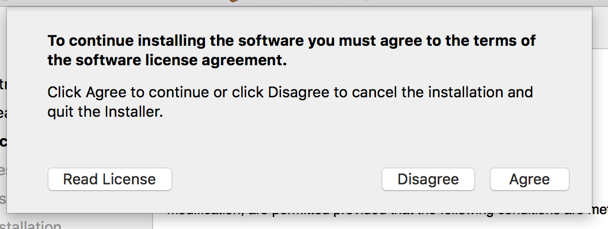

4. *Click* `Install`. Only change the install location if you know what you are doing:

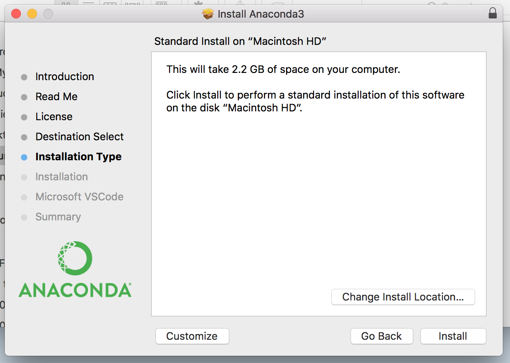

5. *Click* `Install Microsoft VSCode`. If it is already installed, *click* `Continue`:


7. This is the final installation window. Just *Click* `Close`:

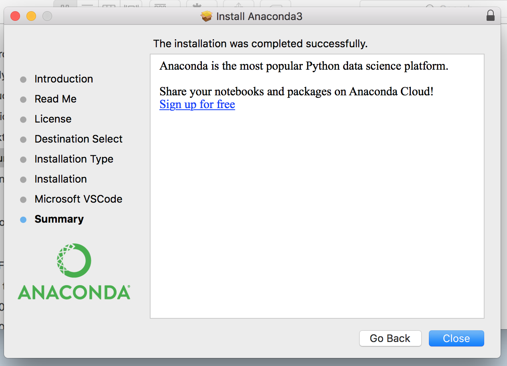

8. You can move the installer to the Trash to save space on your Hard Drive by *clicking* `Move to Trash`:

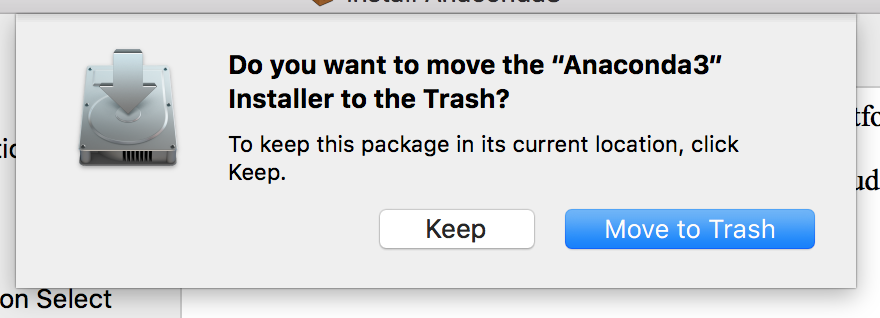

## Test

Open the [OS/X](osx_terminal.md) terminal and type `python`. The terminal should print something like:

    ```python
    Python 3.6.3 |Anaconda, Inc.| (default, Dec  5 2017, 17:30:25) 
    [GCC 4.2.1 Compatible Clang 4.0.1 (tags/RELEASE_401/final)] on darwin
    Type "help", "copyright", "credits" or "license" for more information.
    >>> 
    ```

Type `exit()` to leave python

## References ##

* [Anaconda Cheet Sheet](http://conda.pydata.org/docs/using/cheatsheet.html)

* [Jupyter Reference Sheet](https://damontallen.github.io/IPython-quick-ref-sheets/)

