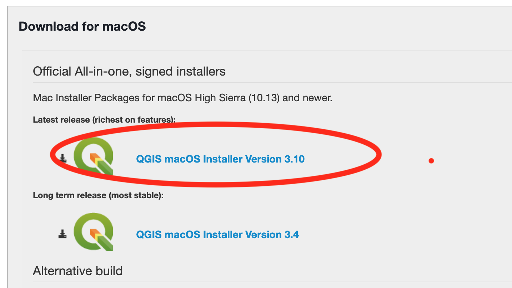

# QGIS

[QGIS](http://www.qgis.org/en/site/) is a free and open source Geographical Information System. 

Please note that in addition to QGIS, participants need to have a spreadsheet program, such as the ones found in Microsoft Office, Libre Office, and Open Office. 

## Download
* Download __QGIS Version 3.10__ from https://qgis.org/en/site/forusers/download.html:

## Windows Install:

1. Download the version "QGIS Standalone Installer Version 3.10 (64 bit)"

2. Follow the instructions provided by the installer you downloaded.  

3. [Test install](#test-install)

## Mac OS/X:

1. Download

2. Follow the instructions provided by the installer you downloaded.  

3. Note, you might receive the following error when you try to open QGIS for the first time:

 In this case, you simply have to right click on the app and select the "Open" option:
 
 
 

4. [Test install](#test-install)

#### Troubleshooting
You may need to change [security & privacy settings](https://support.apple.com/en-us/HT202491) to allow app downloads from outside sources.

## Test Install
 Launch __QGIS 3.10. A new project will look like this:

Instructions are modified from [Michelle A. McSweeney](https://github.com/michellejm/Intro-QGIS-CUNY-FemSTEM/blob/master/Install-QGIS.md)

